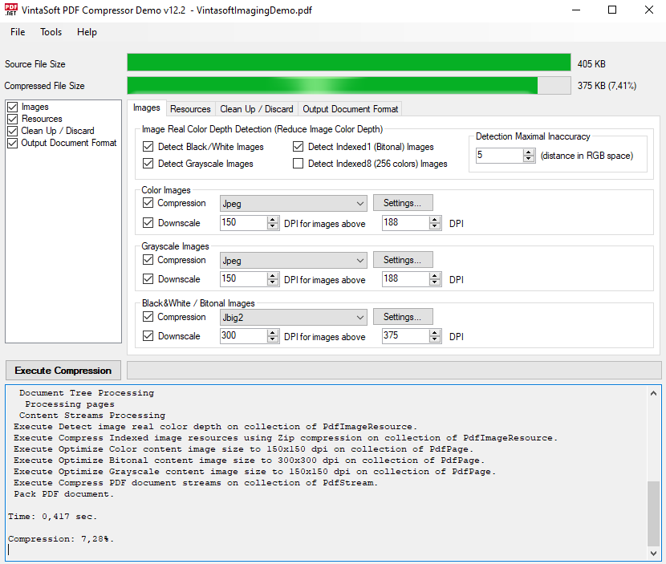

# VintaSoft WinForms PDF Compressor Demo

This C# project uses <a href="https://www.vintasoft.com/vsimaging-dotnet-index.html">VintaSoft Imaging .NET SDK</a> and demonstrates how to compress PDF document:
* Optimize image-resources to a specified resolution.
* Detect image color depth (black-white, grayscale, indexed).
* Recompress image-resources using specified filters and/or compression settings.
* Replace LZW to Flate (ZIP) compression.
* Compress uncompressed resources using Flate (ZIP) compression.
* Recompress resources using Flate (ZIP) compression with maximal level.
* Remove invalid bookmarks.
* Remove all bookmarks.
* Remove embedded page thumbnails.
* Remove all file attachments.
* Remove document information.
* Use compressed XREF table.
* Remove duplicate resources.
* Remove invalid links.
* Remove annotations.
* Remove metadata.
* Remove unused objects.


## Screenshot



## Usage
1. Get the 30 day free evaluation license for <a href="https://www.vintasoft.com/vsimaging-dotnet-index.html" target="_blank">VintaSoft Imaging .NET SDK</a> as described here: <a href="https://www.vintasoft.com/docs/vsimaging-dotnet/Licensing-Evaluation.html" target="_blank">https://www.vintasoft.com/docs/vsimaging-dotnet/Licensing-Evaluation.html</a>

2. Update the evaluation license in "CSharp\MainForm.cs" file:
   ```
   Vintasoft.Imaging.ImagingGlobalSettings.Register("REG_USER", "REG_EMAIL", "EXPIRATION_DATE", "REG_CODE");
   ```

3. Build the project ("PdfCompressorDemo.Net7.csproj" file) in Visual Studio or using .NET CLI:
   ```
   dotnet build PdfCompressorDemo.Net7.csproj
   ```

4. Run compiled application and try to compress PDF document.


## Documentation
VintaSoft Imaging .NET SDK on-line User Guide and API Reference for .NET developer is available here: https://www.vintasoft.com/docs/vsimaging-dotnet/


## Support
Please visit our <a href="https://myaccount.vintasoft.com/">online support center</a> if you have any question or problem.
